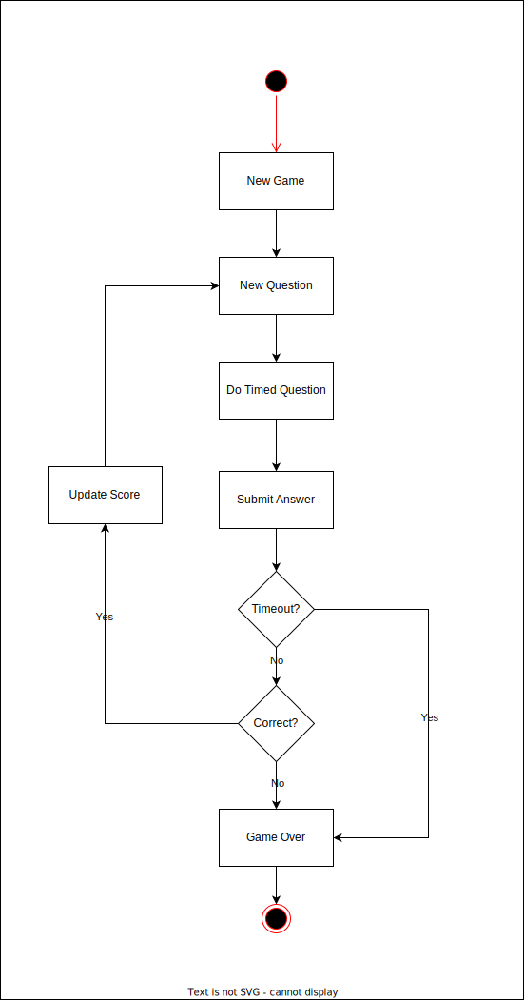

# Hex MathRush

MathRush is simple math game which taking inspiration from [1 + 2 = 3](https://apps.apple.com/sa/app/1-2-3/id953831664). It is intended to be used as reference for building system in Ghazlabs.

The architectural pattern used for building this project is [Hexagonal Architecture](https://medium.com/@matiasvarela/hexagonal-architecture-in-go-cfd4e436faa3). Hence the name `Hex MathRush`.

## Game Flow

The game flow itself is pretty simple, basically user just need to answer the math problem quickly & correctly to make the score higher. Game will end either when user too slow answering the question or choose the wrong answer.

Here is the flowchart of the game:

<p align="center">
    
</p>

## How to Run

This app is powered by docker. So make sure to install it before running below command:

```bash
> make run
```

Upon success, your console should output message like following:

```bash
2022/04/01 15:53:42 server is listening on :9190...
```
